# Gender swap using CycleGAN and live webcam use

This is my implementation of CycleGAN, closely following the original paper Unpaired Image-to-Image Translation using Cycle-Consistent Adversarial Networks by Jun-Yan Zhu, Taesung Park, Phillip Isola, and Alexei A. Efros, as well as Aladdin Persson's tutorial on YouTube.
The goal was image-to-image gender translation using the CelebA-HQ dataset resized to 256x256.

## Results

| Input Images | Fake Gender Swap |
|--------------|------------------|
| 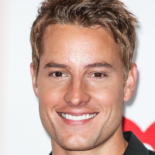 | 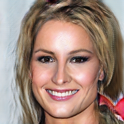 |
| 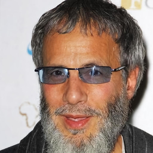 | 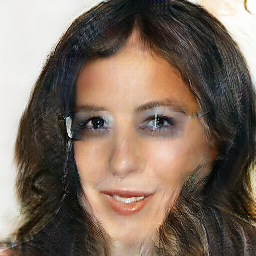 |
| 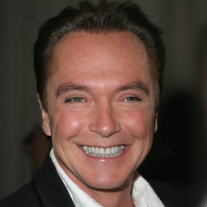 | 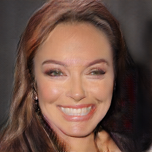 |
| 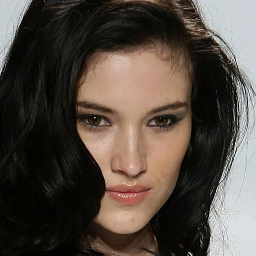 | 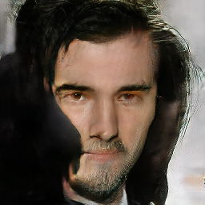 |
| 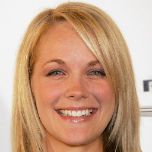 | 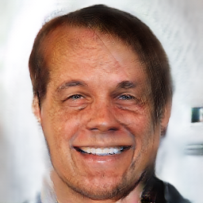 |
| 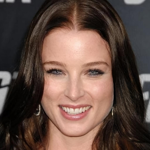 | 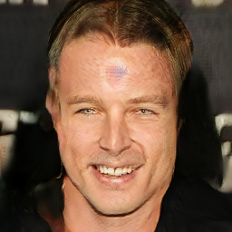 |

## Webcam application

The live webcam application implements and integrates CycleGAN within a dynamic pipeline that incorporates face detection with a Haar cascades classifier provided through cv2, CSRT tracker also provided via cv2, a personalized binary classifier model to label gender and finally CycleGAN for gender swapping.

